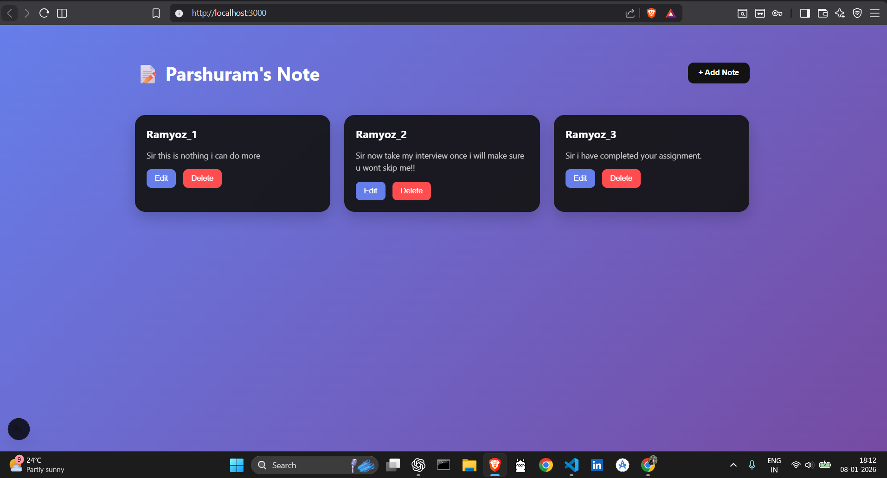

# 📝 Ramyoz Notes App

A modern **full-stack Notes application** built using **Next.js App Router**, **MongoDB**, and a **glassmorphism UI**.  
Users can **add, edit, and delete notes** with smooth animations and a premium interactive experience.

---

## 🚀 How to Run the App

- Clone the repository to your local machine  
- Install all required dependencies using npm  
- Make sure MongoDB is running and a database is created  
- Start the development server  
- Open the app in your browser and begin creating notes  

---

## 🖥️ App Preview

<p align="center">
  
</p>

> _Clean UI with smooth hover animations and modal interactions_

---

## ✨ Features

- ➕ Create notes instantly  
- ✏️ Edit existing notes  
- 🗑️ Delete notes  
- 🎨 Advanced UI with glassmorphism  
- 🪄 3D hover effects (cards lift out of the screen)  
- ⚡ Fast API using Next.js App Router  
- 🗄️ MongoDB database integration  

---

## 🛠️ Tech Stack

- **Frontend:** Next.js (App Router), React  
- **Backend:** Next.js API Routes  
- **Database:** MongoDB (Mongoose)  
- **Styling:** Pure CSS (Glassmorphism, 3D hover)  
- **Deployment Ready:** Vercel  

---

## 📦 Getting Started (Commands)

```bash
npm install
npm run dev
